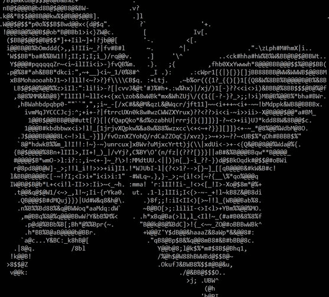

# Image to ascii converter
 
An image to ASCII characters converter! Give it by command line argument an image to convert and it does the rest following an algorithm invented by me.

    -Instructions:

        (Important: opencv2 library for C++ is required to compile the program)
        
        1)  Use this variables to select the final resolution of the image in the command line or if you want to invert the color.
        
                const int character_canvas = 100;
                const bool invert_color = false;

        2)  Execute the code indicating the image location by argument.
        
        3) Run the program.
         
        4) Use ctrl+mouse_wheel to zoom_out the view in the command line (in windows) and resize the window until the image is well displayed.

